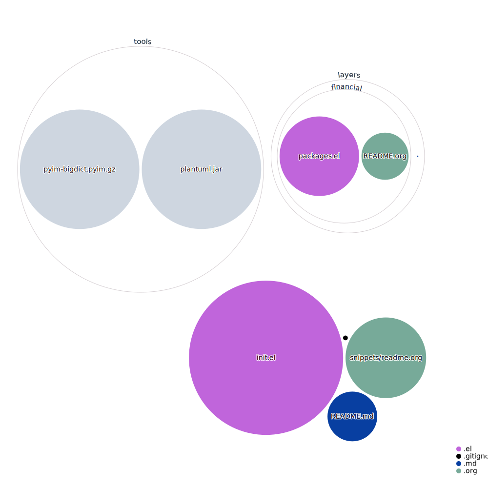

# this project is for my [spacemacs](http://spacemacs.org/) configuration

## how to use
	git clone https://github.com/idears-studio/.spacemacs.d.git ~/.spacemacs.d
and remove your ~/.spacemacs files, **don't forget to make a backup**

## features

* enable python, c-c++, semantic, scope layers

* enable auto-completion, markdown, shell, spell-checking, syntax-checking, imenu-list

	> for c-c++ autocompletion, you need clang installed
	> c-c++ indent use linux style

* disable https and use chinese mirrors

* use random text banners

* enable distinguish-gui-tab to use C-i and C-o jump in source code

* auto resume last layouts when startup

* maximized window at startup

* enable line numbers

* enable Delete whitespace while saving buffer

* turn on fci-mode for 80 line ruler

* set ispell use american dictionary

* enable global indent guide mode

## tools

there is some tools in subdirectory such as win64

*for windows, we need aspell for spell checking*

## python layers

pip install pylint for syntax-checking

*in my PC, I need replaced the default anaconda-mode dependency jedi from version 0.10.\* to version <0.9.0 such as 0.8.1 in $HOME/emacs.d/.cache/anaconda-mode/0.1.8*

## changes with default settings
you can use SPC-f e D for diff with default one **don't froget install diff tools, for me I use colordiff in msys2**

